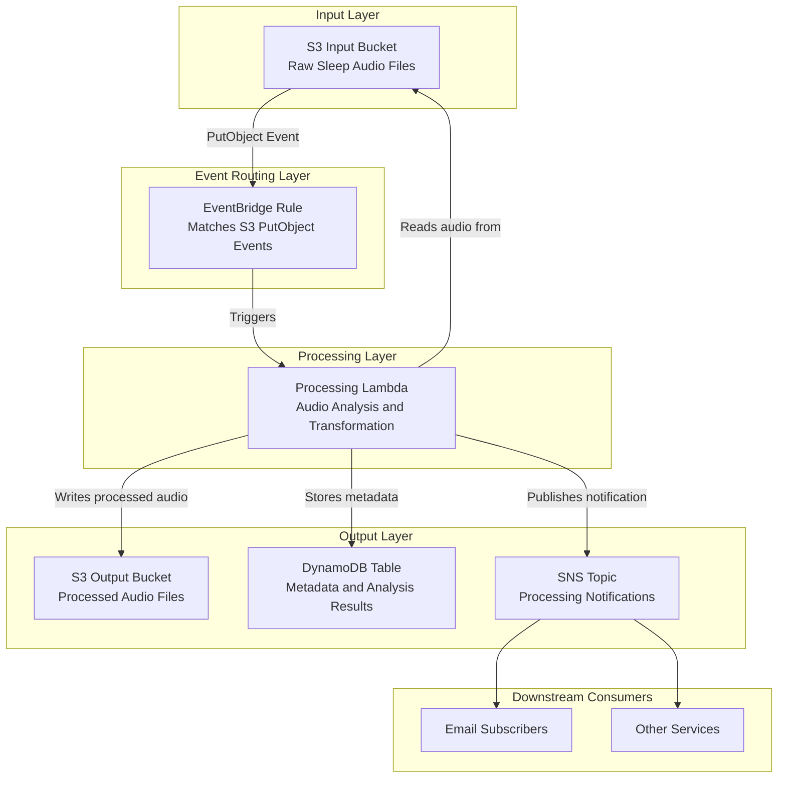

# Architecture

## Pipeline Overview

This project implements an event-driven sleep audio processing pipeline using AWS CDK (Java). The pipeline automatically processes sleep audio files as they are uploaded, extracts metadata and analysis results, and notifies downstream consumers.

### Components and Flow

**S3 Input Bucket** - The entry point of the pipeline. Users or upstream systems upload raw sleep audio files (e.g., WAV, MP3) to this bucket. Each upload triggers the pipeline automatically.

**EventBridge Rule** - Amazon EventBridge monitors the S3 Input Bucket for `PutObject` events. When a new audio file lands in the input bucket, EventBridge matches the event against a rule configured to detect new uploads and routes it to the processing component. This decouples the storage layer from the processing layer, allowing flexible routing and filtering.

**Processing Component (Lambda / Step Functions)** - The core processing logic is triggered by the EventBridge rule. This component receives the event payload containing the S3 bucket name and object key, retrieves the audio file, and performs analysis. Processing may include audio quality assessment, duration extraction, silence detection, and sleep pattern analysis. For simple transformations a single Lambda function suffices; for multi-step workflows a Step Functions state machine orchestrates the stages.

**S3 Output Bucket** - Processed or transformed audio files are stored in a dedicated output bucket. This keeps raw uploads separate from processed results, enabling independent lifecycle policies and access controls.

**DynamoDB Table** - Metadata and analysis results (e.g., duration, quality score, detected patterns, timestamps) are persisted in a DynamoDB table. This provides fast, scalable lookup of processing results by file ID or timestamp.

**SNS Topic** - After processing completes, a notification is published to an SNS topic. Subscribers (email, SMS, other Lambda functions, or external systems) receive alerts about completed processing, errors, or summary results.

### How the Components Connect

1. A sleep audio file is uploaded to the S3 Input Bucket.
2. S3 emits a PutObject event to EventBridge.
3. The EventBridge rule matches the event and invokes the Processing component.
4. The Processing component reads the audio file from the Input Bucket.
5. Processing results are written to three destinations:
   - Transformed audio to the S3 Output Bucket
   - Metadata and analysis results to the DynamoDB Table
   - A completion notification to the SNS Topic
6. SNS delivers the notification to all subscribed endpoints.

## Architecture Diagram

