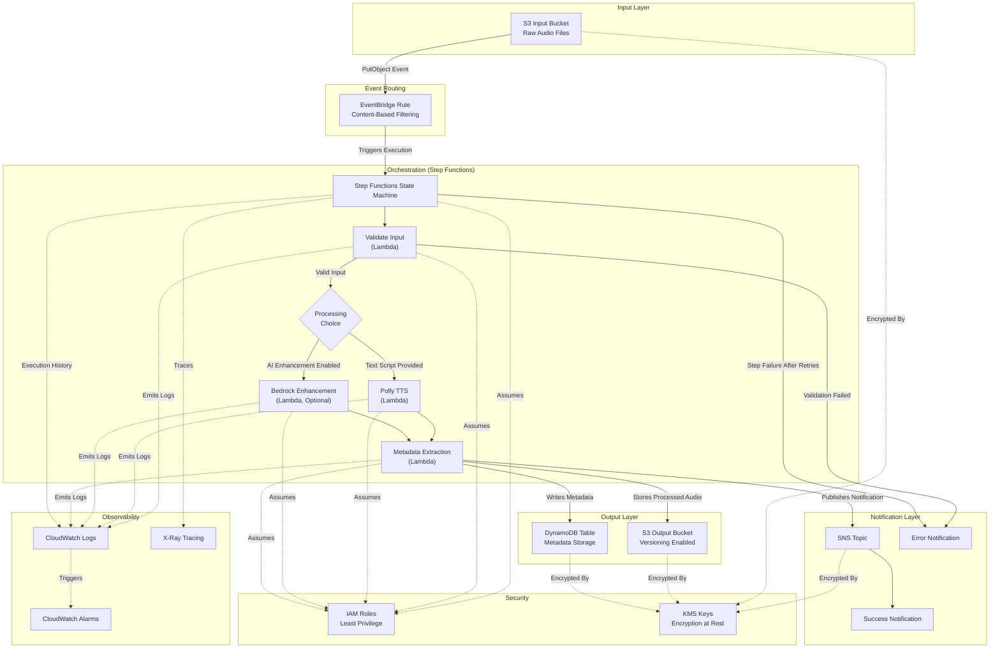

# Architecture: Event-Driven Sleep Audio Pipeline

## High-Level Overview

This project implements a production-grade, event-driven sleep audio processing pipeline using AWS CDK (Java). The system enables users to upload raw audio files (voice recordings, ambient sounds, guided meditations) to an input S3 bucket where they are automatically processed through a multi-stage orchestration pipeline.

**Core workflow:**

1. Users upload raw audio files to the S3 Input Bucket.
2. Amazon EventBridge detects the upload event and triggers an AWS Step Functions state machine.
3. The Step Functions state machine orchestrates multiple processing steps:
   - Input validation and metadata extraction
   - Amazon Polly for text-to-speech and soothing voice generation
   - Optional Amazon Bedrock for AI-generated sleep sounds or audio enhancement
4. Processed audio is saved to an output S3 bucket with versioning enabled.
5. Metadata (duration, user_id, processing status, timestamps) is stored in DynamoDB.
6. Completion or error notifications are sent via SNS.

The pipeline supports multi-environment deployment (dev/stage/prod) driven by CDK context values, allowing teams to iterate safely in lower environments before promoting to production.

---

## Data Flow

The following describes how data moves through the system from initial upload to final notification:

1. **Upload**: A user or upstream system uploads a raw audio file (WAV, MP3, OGG) to the S3 Input Bucket.
2. **Event Emission**: S3 emits a `PutObject` event to Amazon EventBridge.
3. **Event Routing**: EventBridge evaluates the event against content-based filtering rules (e.g., file extension, prefix, size constraints) and routes matching events to the Step Functions state machine.
4. **Orchestration Start**: Step Functions begins execution with the event payload containing the bucket name, object key, and event metadata.
5. **Validate Input** (Lambda): The first state validates the uploaded file (checks file format, size limits, required metadata tags) and extracts basic properties. On validation failure, the state machine transitions to the error notification path.
6. **Processing Choice**: A Choice state evaluates the input type and processing configuration:
   - If the upload includes a text script for voice generation, route to Polly TTS.
   - If AI enhancement is enabled (feature flag), route to Bedrock Enhancement.
   - Both paths can execute in parallel when applicable.
7. **Polly TTS** (Lambda): Invokes Amazon Polly with Neural TTS to generate soothing voice audio from provided text scripts. Supports multiple voices and languages.
8. **Bedrock Enhancement** (Lambda, optional): Invokes Amazon Bedrock foundation models to generate AI sleep sounds or enhance existing audio with ambient layers. This step is gated by an environment feature flag.
9. **Metadata Extraction** (Lambda): Extracts final metadata (duration, format, sample rate, processing timestamps) from the processed audio and prepares the DynamoDB record.
10. **Store Processed Audio**: The processed audio file is written to the S3 Output Bucket with versioning enabled, preserving all historical versions.
11. **Write Metadata**: Processing results and metadata (duration, user_id, processing status, timestamps, output location) are written to the DynamoDB Table.
12. **Publish Notification**: An SNS notification is published indicating successful completion, including a reference to the processed file location.
13. **Error Handling**: If any step fails after configured retries, the state machine transitions to an error handler that publishes a failure notification via SNS with error details and context for debugging.

---

## AWS Services and Justification

| Service | Role | Justification |
|---------|------|---------------|
| **S3 (Input Bucket)** | Durable object storage for raw audio uploads | Highly durable (99.999999999%), native event notifications, cost-effective for large binary files |
| **S3 (Output Bucket)** | Versioned storage for processed audio | Versioning preserves processing history, lifecycle policies manage storage costs over time |
| **Amazon EventBridge** | Decoupled event routing from S3 to processing | Content-based filtering rules, supports multiple targets, decouples storage from compute, native S3 integration |
| **AWS Step Functions** | Visual workflow orchestration | Built-in error handling and retries, parallel execution support, execution history for debugging, no custom orchestration code needed |
| **AWS Lambda** (within Step Functions) | Serverless compute for individual processing steps | Pay-per-invocation, scales to zero, ideal for event-driven short-duration tasks, integrates natively with Step Functions |
| **Amazon Polly** | Neural TTS for soothing voice generation | High-quality Neural voices, multiple languages and voice options, low-latency synthesis, pay-per-character pricing |
| **Amazon Bedrock** | Foundation models for AI-generated sleep sounds or audio enhancement | Access to multiple foundation models without managing infrastructure, serverless inference, configurable for different audio generation tasks |
| **Amazon DynamoDB** | Metadata and processing status storage | Single-digit millisecond read/write latency, pay-per-request scaling, no capacity planning required, ideal for key-value lookups |
| **Amazon SNS** | Fan-out notifications for processing results | Multiple subscriber types (email, SMS, Lambda, SQS), topic-based pub/sub, decouples notification from processing logic |
| **Amazon CloudWatch** | Centralized logging, metrics, and alarms | Native integration with all AWS services, custom metrics support, configurable alarm actions, log aggregation |
| **AWS IAM** | Fine-grained access control | Least-privilege principle enforcement, service-linked roles, resource-based policies for cross-service access |
| **AWS KMS** | Encryption key management | Centralized key lifecycle management, automatic key rotation, audit trail via CloudTrail, integrates with S3/DynamoDB/SNS encryption |

---

## Security

### Least-Privilege IAM Roles

- **Step Functions Execution Role**: Permissions limited to invoking specific Lambda functions within the state machine and reading CloudWatch Logs.
- **Validate Input Lambda Role**: Read-only access to the S3 Input Bucket, no write permissions to any other resource.
- **Polly TTS Lambda Role**: Read access to the S3 Input Bucket, write access to the S3 Output Bucket, and `polly:SynthesizeSpeech` permission scoped to specific voices.
- **Bedrock Enhancement Lambda Role**: Read access to the S3 Input Bucket, write access to the S3 Output Bucket, and `bedrock:InvokeModel` permission scoped to specific model IDs.
- **Metadata Extraction Lambda Role**: Read access to the S3 Output Bucket, write access to the DynamoDB Table, and publish permission to the SNS Topic.

### Encryption at Rest

- **S3 Buckets**: Server-side encryption with AWS KMS (SSE-KMS) using a dedicated Customer Managed Key (CMK) per environment.
- **DynamoDB Table**: Encryption at rest enabled with AWS KMS.
- **SNS Topic**: Server-side encryption enabled with KMS to protect notification payloads.

### Private Buckets

- S3 Block Public Access is enabled on all buckets (account-level and bucket-level).
- Bucket policies explicitly deny any requests that do not use SSL (aws:SecureTransport condition).
- Resource policies restrict cross-account access to authorized principals only.

---

## Observability

### Logging

- All Lambda functions emit structured JSON logs to CloudWatch Logs with correlation IDs tied to the Step Functions execution ID.
- Step Functions execution history is retained with full input/output capture for debugging.
- Log retention periods are environment-specific (dev: 7 days, stage: 30 days, prod: 90 days).

### Metrics

- **Custom Metrics**: Processing duration per step, audio file sizes, Polly character count per invocation, Bedrock inference latency.
- **Standard Metrics**: Lambda invocation count, error count, duration, throttles; Step Functions executions started, succeeded, failed, timed out.

### Alarms

- Error rate threshold alarms on each Lambda function (e.g., >5% error rate over 5 minutes).
- Step Functions execution failure alarm (any failed execution in prod triggers alert).
- DLQ message depth alarm for any configured dead-letter queues.
- Polly/Bedrock throttling alarms to detect service limit pressure.

### Tracing

- AWS X-Ray tracing enabled for all Lambda functions and Step Functions to provide end-to-end request visibility across the entire pipeline.

---

## Cost Considerations

### Cost Drivers

| Driver | Pricing Model | Notes |
|--------|--------------|-------|
| S3 Storage and Requests | Per-GB stored + per-request | Audio files can be large; request costs scale with upload volume |
| Step Functions State Transitions | Per state transition | Each step in the state machine incurs a charge |
| Lambda Duration | Per-ms of compute time | Audio processing may require higher memory allocation |
| Amazon Polly Character Count | Per character (Standard vs Neural) | Neural voices cost more but provide higher quality |
| Amazon Bedrock Inference | Per input/output token | Costs vary by model; longer generation tasks increase cost |

### Optimization Strategies

- **S3 Lifecycle Policies**: Transition processed audio to S3 Intelligent-Tiering or Glacier after configurable retention periods. Remove incomplete multipart uploads after 7 days.
- **Lambda Memory Right-Sizing**: Use AWS Lambda Power Tuning to identify optimal memory/cost configuration for each function.
- **Polly Voice Selection**: Use Standard voices for development/testing, reserve Neural voices for production where audio quality matters.
- **Bedrock Provisioned Throughput**: For predictable production workloads, consider provisioned throughput to reduce per-inference cost.
- **Step Functions Express Workflows**: Evaluate Express Workflows for high-volume, short-duration executions to reduce state transition costs.

---

## Multi-Environment Strategy

CDK context values (defined in `cdk.json` or passed via `-c` command-line flags) drive environment-specific configuration:

```
cdk deploy -c environment=prod
cdk deploy -c environment=stage
cdk deploy -c environment=dev
```

### Environment-Specific Configuration

| Configuration | Dev | Stage | Prod |
|--------------|-----|-------|------|
| Bucket name prefix | `dev-sleep-audio` | `stage-sleep-audio` | `prod-sleep-audio` |
| CloudWatch Log retention | 7 days | 30 days | 90 days |
| Alarm thresholds (error rate) | 20% | 10% | 5% |
| Bedrock enhancement enabled | Disabled | Enabled | Enabled |
| S3 versioning | Disabled | Enabled | Enabled |
| DynamoDB billing mode | Pay-per-request | Pay-per-request | Pay-per-request |
| SNS encryption | Optional | Enabled | Enabled |

### Feature Flags

- `bedrockEnabled`: Controls whether the Bedrock Enhancement step is included in the Step Functions state machine. Disabled in dev to reduce costs.
- `pollyVoiceType`: Selects Standard (dev/stage) or Neural (prod) voice engine.
- `alarmActionsEnabled`: Enables or disables alarm notification actions (disabled in dev to reduce noise).

---

## Future Extensibility

The architecture is designed to support the following planned extensions:

- **API Gateway + Presigned URLs**: Expose a REST API that generates presigned S3 upload URLs, enabling direct client-to-S3 uploads without proxying through a backend server.
- **Amazon Cognito**: User authentication and authorization, providing user identity for the `user_id` metadata field and controlling access to processed audio.
- **Amazon CloudFront**: CDN distribution for processed audio files, reducing latency for global users and offloading traffic from S3.
- **Additional Audio Processing Models**: Integration with custom ML models (SageMaker endpoints) for advanced audio analysis such as sleep quality scoring or sound classification.
- **Batch Processing with Step Functions Distributed Map**: Process large backlogs of audio files in parallel using the Distributed Map state for high-throughput batch operations.
- **WebSocket Notifications**: Real-time processing status updates to connected clients via API Gateway WebSocket APIs, replacing polling-based status checks.

---

## Implementation Status

This document describes the target architecture. Components will be implemented incrementally following the project's test-driven development (TDD) workflow. As each construct is added to the CDK stack, corresponding unit tests will be written first (red), then the infrastructure code implemented (green), and finally refactored as needed. The Mermaid diagram and textual descriptions will be kept in sync with the implemented components.

---

## Architecture Diagram


