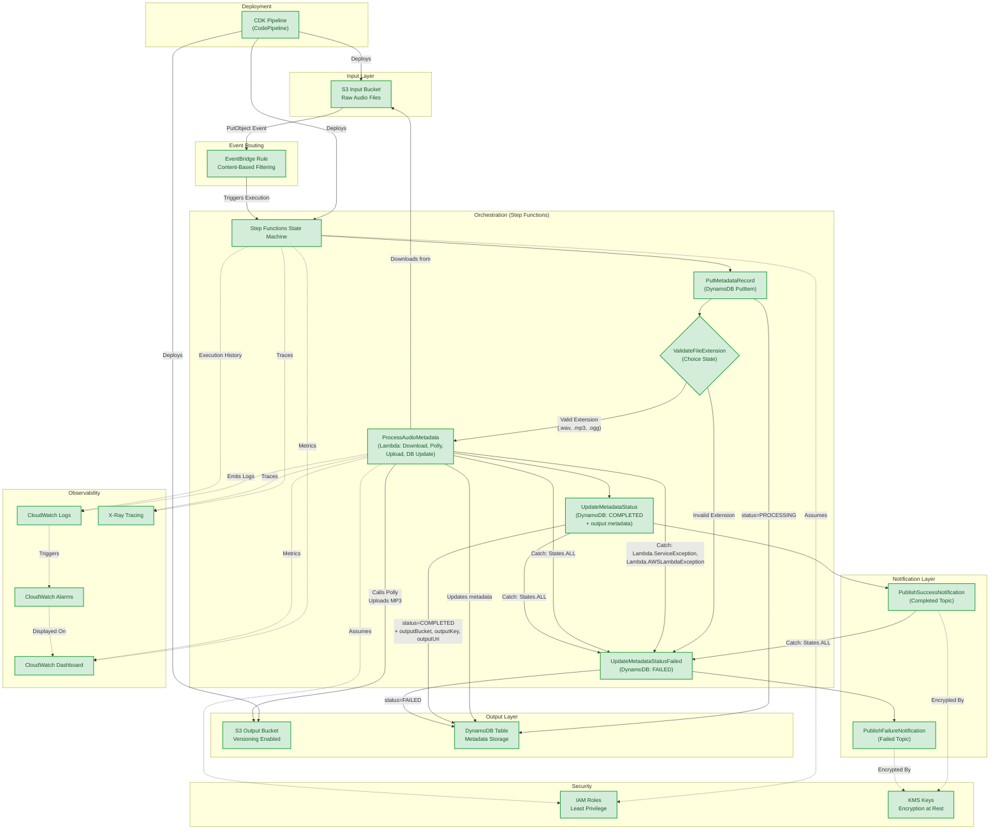

# Architecture: Event-Driven Sleep Audio Pipeline

## High-Level Overview

This project implements a production-grade, event-driven sleep audio processing pipeline using AWS CDK (Java). The system enables users to upload raw audio files (voice recordings, ambient sounds, guided meditations) to an input S3 bucket where they are automatically processed through a multi-stage orchestration pipeline.

**Core workflow:**

1. Users upload raw audio files to the S3 Input Bucket.
2. Amazon EventBridge detects the upload event and triggers an AWS Step Functions state machine.
3. The Step Functions state machine orchestrates multiple processing steps:
   - Input validation (file extension check)
   - Audio processing via Lambda (S3 download, Polly TTS synthesis, S3 upload, DynamoDB metadata update)
   - Status update and success/failure notification
4. Processed audio is saved to an output S3 bucket with versioning enabled.
5. Metadata (output location, file size, processing status, timestamps) is stored in DynamoDB.
6. Completion or error notifications are sent via SNS.

The pipeline supports multi-environment deployment (dev/stage/prod) driven by CDK context values, allowing teams to iterate safely in lower environments before promoting to production.

---

## Data Flow

The following describes how data moves through the system from initial upload to final notification:

1. **Upload**: A user or upstream system uploads a raw audio file (WAV, MP3, OGG) to the S3 Input Bucket.
2. **Event Emission**: S3 emits a `PutObject` event to Amazon EventBridge.
3. **Event Routing**: EventBridge evaluates the event against content-based filtering rules (e.g., file extension, prefix, size constraints) and routes matching events to the Step Functions state machine.
4. **Orchestration Start**: Step Functions begins execution with the event payload containing the bucket name, object key, and event metadata.
5. **Validate Input** (Lambda): The first state validates the uploaded file (checks file format, size limits, required metadata tags) and extracts basic properties. On validation failure, the state machine transitions to the error notification path.
6. **Processing Choice**: A Choice state evaluates the input type and routes to exactly one processing branch (mutually exclusive):
   - If the upload includes a text script for voice generation, route to Polly TTS.
   - Otherwise, route to Bedrock Enhancement for AI-generated audio (only available when the Bedrock branch is synthesized; see Feature Flags).
7. **Polly TTS** (Lambda): Invokes Amazon Polly with Neural TTS to generate soothing voice audio from provided text scripts. Supports multiple voices and languages. On completion, writes the processed audio file to the S3 Output Bucket.
8. **Bedrock Enhancement** (Lambda, optional): Invokes Amazon Bedrock foundation models to generate AI sleep sounds or enhance existing audio with ambient layers. This step is only present in the deployed state machine when `bedrockEnabled` is true at CDK synth time (see Feature Flags). On completion, writes the processed audio file to the S3 Output Bucket.
9. **Metadata Extraction** (Lambda): Reads the processed audio from the S3 Output Bucket and extracts final metadata (duration, format, sample rate, processing timestamps). Prepares the DynamoDB record.
10. **Write Metadata**: Processing results and metadata (duration, user_id, processing status, timestamps, output location) are written to the DynamoDB Table. The `user_id` field is derived from S3 object metadata set by the uploading client (see below).
11. **Publish Notification**: An SNS notification is published indicating successful completion, including a reference to the processed file location.
12. **Error Handling**: If any step fails after configured retries, the state machine transitions to an error handler that publishes a failure notification via SNS with error details and context for debugging.

**Note on `user_id`:** The `user_id` field referenced in metadata is an optional value populated via S3 object metadata (the `x-amz-meta-user-id` header) set by the uploading client at upload time. When no user identity is provided, the field is stored as null. In a future iteration, when Amazon Cognito is added (see Future Extensibility), `user_id` will be derived from the authenticated identity of the caller.

---

## AWS Services and Justification

| Service | Role | Justification |
|---------|------|---------------|
| **S3 (Input Bucket)** | Durable object storage for raw audio uploads | Highly durable (99.999999999%), native event notifications, cost-effective for large binary files |
| **S3 (Output Bucket)** | Versioned storage for processed audio | Versioning preserves processing history, lifecycle policies manage storage costs over time |
| **Amazon EventBridge** | Decoupled event routing from S3 to processing | Content-based filtering rules, supports multiple targets, decouples storage from compute, native S3 integration |
| **AWS Step Functions** | Visual workflow orchestration | Built-in error handling and retries, parallel execution support, execution history for debugging, no custom orchestration code needed |
| **AWS Lambda** (within Step Functions) | Serverless compute for individual processing steps | Pay-per-invocation, scales to zero, ideal for event-driven short-duration tasks, integrates natively with Step Functions |
| **Amazon Polly** | Neural TTS for soothing voice generation | High-quality Neural voices, multiple languages and voice options, low-latency synthesis, pay-per-character pricing |
| **Amazon Bedrock** | Foundation models for AI-generated sleep sounds or audio enhancement | Access to multiple foundation models without managing infrastructure, serverless inference, configurable for different audio generation tasks |
| **Amazon DynamoDB** | Metadata and processing status storage | Single-digit millisecond read/write latency, pay-per-request scaling, no capacity planning required, ideal for key-value lookups |
| **Amazon SNS** | Fan-out notifications for processing results | Multiple subscriber types (email, SMS, Lambda, SQS), topic-based pub/sub, decouples notification from processing logic |
| **Amazon CloudWatch** | Centralized logging, metrics, and alarms | Native integration with all AWS services, custom metrics support, configurable alarm actions, log aggregation |
| **AWS IAM** | Fine-grained access control | Least-privilege principle enforcement, service-linked roles, resource-based policies for cross-service access |
| **AWS KMS** | Encryption key management | Centralized key lifecycle management, automatic key rotation, audit trail via CloudTrail, integrates with S3/DynamoDB/SNS encryption |

---

## Security

### Least-Privilege IAM Roles

- **Step Functions Execution Role**: Permissions limited to invoking specific Lambda functions within the state machine and reading CloudWatch Logs.
- **Validate Input Lambda Role**: Read-only access to the S3 Input Bucket, no write permissions to any other resource.
- **Polly TTS Lambda Role**: Read access to the S3 Input Bucket, write access to the S3 Output Bucket, and `polly:SynthesizeSpeech` permission scoped to specific voices.
- **Bedrock Enhancement Lambda Role**: Read access to the S3 Input Bucket, write access to the S3 Output Bucket, and `bedrock:InvokeModel` permission scoped to specific model IDs.
- **Metadata Extraction Lambda Role**: Read access to the S3 Output Bucket, write access to the DynamoDB Table, and publish permission to the SNS Topic.

### Encryption at Rest

- **S3 Buckets**: Server-side encryption with AWS KMS (SSE-KMS) using a dedicated Customer Managed Key (CMK) per environment.
- **DynamoDB Table**: Encryption at rest enabled with AWS KMS.
- **SNS Topic**: Server-side encryption enabled with KMS to protect notification payloads.

### Private Buckets

- S3 Block Public Access is enabled on all buckets (account-level and bucket-level).
- Bucket policies explicitly deny any requests that do not use SSL (aws:SecureTransport condition).
- Resource policies restrict cross-account access to authorized principals only.

---

## Observability

### Logging

- All Lambda functions emit structured JSON logs to CloudWatch Logs with correlation IDs tied to the Step Functions execution ID.
- Step Functions execution history is retained with full input/output capture for debugging.
- Log retention periods are environment-specific (dev: 7 days, stage: 30 days, prod: 90 days).

### Metrics

- **Custom Metrics**: Processing duration per step, audio file sizes, Polly character count per invocation, Bedrock inference latency.
- **Standard Metrics**: Lambda invocation count, error count, duration, throttles; Step Functions executions started, succeeded, failed, timed out.

### Alarms

The following CloudWatch Alarms are deployed:

- **StateMachineExecutionFailedAlarm**: Monitors the `ExecutionsFailed` metric on the state machine. Threshold: >= 1 failure within a 300-second (5-minute) evaluation period. Comparison: GreaterThanOrEqualToThreshold.
- **LambdaErrorAlarm**: Monitors the `Errors` metric on the SleepAudioProcessor Lambda function. Threshold: >= 1 error within a 300-second (5-minute) evaluation period. Comparison: GreaterThanOrEqualToThreshold.

Future alarms planned:
- Polly/Bedrock throttling alarms to detect service limit pressure.
- Error rate percentage alarms (>5% over 5 minutes) for production environments.

### Tracing

AWS X-Ray tracing is enabled for end-to-end request visibility across the entire pipeline:

- **Lambda Function**: X-Ray active tracing is enabled on the SleepAudioProcessor Lambda function (`TracingConfig Mode=Active`), which instruments all downstream AWS SDK calls.
- **State Machine**: X-Ray tracing is enabled on the Step Functions state machine (`TracingConfiguration Enabled=true`), providing visibility into state transitions, task invocations, and error paths.

### Dashboard

A CloudWatch Dashboard (`SleepAudioPipelineDashboard`) is deployed with the following widgets:

- **State Machine Executions**: A GraphWidget displaying `ExecutionsStarted`, `ExecutionsSucceeded`, and `ExecutionsFailed` metrics for the state machine.
- **Lambda Function Metrics**: A GraphWidget displaying `Invocations`, `Errors`, and `Duration` metrics for the SleepAudioProcessor Lambda function.

---

## Cost Considerations

### Cost Drivers

| Driver | Pricing Model | Notes |
|--------|--------------|-------|
| S3 Storage and Requests | Per-GB stored + per-request | Audio files can be large; request costs scale with upload volume |
| Step Functions State Transitions | Per state transition | Each step in the state machine incurs a charge |
| Lambda Duration | Per-ms of compute time | Audio processing may require higher memory allocation |
| Amazon Polly Character Count | Per character (Standard vs Neural) | Neural voices cost more but provide higher quality |
| Amazon Bedrock Inference | Per input/output token | Costs vary by model; longer generation tasks increase cost |

### Optimization Strategies

- **S3 Lifecycle Policies**: Transition processed audio to S3 Intelligent-Tiering or Glacier after configurable retention periods. Remove incomplete multipart uploads after 7 days.
- **Lambda Memory Right-Sizing**: Use AWS Lambda Power Tuning to identify optimal memory/cost configuration for each function.
- **Polly Voice Selection**: Use Standard voices for development/testing, reserve Neural voices for production where audio quality matters.
- **Bedrock Provisioned Throughput**: For predictable production workloads, consider provisioned throughput to reduce per-inference cost.
- **Step Functions Express Workflows**: Evaluate Express Workflows for high-volume, short-duration executions to reduce state transition costs.

---

## Multi-Environment Strategy

CDK context values (defined in `cdk.json` or passed via `-c` command-line flags) drive environment-specific configuration:

```
cdk deploy -c environment=prod
cdk deploy -c environment=stage
cdk deploy -c environment=dev
```

### Environment-Specific Configuration

| Configuration | Dev | Stage | Prod |
|--------------|-----|-------|------|
| Bucket name prefix | `dev-sleep-audio` | `stage-sleep-audio` | `prod-sleep-audio` |
| CloudWatch Log retention | 7 days | 30 days | 90 days |
| Alarm thresholds (error rate) | 20% | 10% | 5% |
| Bedrock enhancement enabled | Disabled | Enabled | Enabled |
| S3 versioning | Disabled | Enabled | Enabled |
| DynamoDB billing mode | Pay-per-request | Pay-per-request | Pay-per-request |
| SNS encryption | Optional | Enabled | Enabled |

### Feature Flags

- `bedrockEnabled`: A CDK synth-time flag. When set to `true`, the Bedrock Enhancement Lambda, its IAM role, and the corresponding Choice branch are synthesized into the CloudFormation template. When set to `false`, these resources are omitted entirely from the deployed stack (no Lambda deployed, no IAM role created, no cost incurred). The Choice state in the diagram routes between Polly TTS and Bedrock Enhancement based on input type (text script present vs not); this routing logic is only present when `bedrockEnabled` is true. Changing this flag requires a CDK redeploy.
- `pollyVoiceType`: Selects Standard (dev/stage) or Neural (prod) voice engine.
- `alarmActionsEnabled`: Enables or disables alarm notification actions (disabled in dev to reduce noise).

---

## Future Extensibility

The architecture is designed to support the following planned extensions:

- **API Gateway + Presigned URLs**: Expose a REST API that generates presigned S3 upload URLs, enabling direct client-to-S3 uploads without proxying through a backend server.
- **Amazon Cognito**: User authentication and authorization, providing user identity for the `user_id` metadata field and controlling access to processed audio.
- **Amazon CloudFront**: CDN distribution for processed audio files, reducing latency for global users and offloading traffic from S3.
- **Additional Audio Processing Models**: Integration with custom ML models (SageMaker endpoints) for advanced audio analysis such as sleep quality scoring or sound classification.
- **Batch Processing with Step Functions Distributed Map**: Process large backlogs of audio files in parallel using the Distributed Map state for high-throughput batch operations.
- **WebSocket Notifications**: Real-time processing status updates to connected clients via API Gateway WebSocket APIs, replacing polling-based status checks.

---

## Implementation Status

This document describes the implemented architecture. All core pipeline components are deployed and validated by 104+ automated CDK assertion tests. The Mermaid diagram below uses green styling for all implemented components.

### Implemented

| Component | CDK Logical ID | Configuration |
|-----------|---------------|---------------|
| **S3 Input Bucket** | `SleepAudioInputBucket` | SSE-S3 encryption, versioning enabled, block public access, SSL enforcement, EventBridge notifications enabled |
| **S3 Output Bucket** | `SleepAudioOutputBucket` | SSE-S3 encryption, versioning enabled, block public access, SSL enforcement |
| **EventBridge Rule** | `SleepAudioInputRule` | Triggers on Object Created events from Input Bucket, targets Step Functions state machine with event detail as input |
| **Step Functions State Machine** | `SleepAudioPipelineStateMachine` | PutItem -> ValidateFileExtension(Choice) -> ProcessAudioMetadata(Lambda) -> UpdateItem(COMPLETED) -> SNS Publish(success) chain with Catch-based error handling, CloudWatch logging (ALL), EventBridge triggered |
| **ValidateFileExtension (Choice State)** | `ValidateFileExtension` | Choice state that checks `$.object.key` for valid audio file extensions (.wav, .mp3, .ogg). Valid extensions proceed to ProcessAudioMetadata; invalid extensions route to failure path (UpdateMetadataStatusFailed -> PublishFailureNotification) |
| **Lambda: SleepAudioProcessor** | `SleepAudioProcessor` | Python 3.12 runtime, full audio processing pipeline (S3 download, Polly synthesis, S3 upload, DynamoDB update), environment variables: TABLE_NAME, INPUT_BUCKET_NAME, OUTPUT_BUCKET_NAME, granted DynamoDB read/write, S3 input read, S3 output read/write, Polly SynthesizeSpeech permissions |
| **DynamoDB Metadata Table** | `SleepAudioMetadataTable` | PAY_PER_REQUEST billing, partition key audioId (S), AWS-owned encryption (DEFAULT), point-in-time recovery enabled, removal policy RETAIN |
| **SNS Topic (Completed)** | `SleepAudioPipelineCompleted` | KMS-encrypted, receives success notifications after pipeline completion |
| **SNS Topic (Failed)** | `SleepAudioPipelineFailed` | KMS-encrypted, receives failure notifications when pipeline errors occur |
| **KMS Key (SNS)** | `SnsEncryptionKey` | Key rotation enabled, encrypts both SNS topics |
| **PipelineStack** | `SleepAudioPipeline` | CDK Pipelines CodePipeline skeleton with GitHub connection source and ShellStep synth (mvn compile, npx cdk synth). Placeholder connection ARN for future CI/CD integration. |
| **Multi-Environment Support** | N/A (context-driven) | Reads `environment` CDK context (default: "dev"), applies `Environment` tag to all stack resources. Configured in cdk.json and overridable via `-c environment=prod`. |
| **X-Ray Tracing (Lambda)** | `SleepAudioProcessor` | Active tracing enabled (`TracingConfig Mode=Active`) for downstream AWS SDK call instrumentation |
| **X-Ray Tracing (State Machine)** | `SleepAudioPipelineStateMachine` | Tracing enabled (`TracingConfiguration Enabled=true`) for state transition visibility |
| **CloudWatch Alarm (State Machine)** | `StateMachineExecutionFailedAlarm` | Metric: ExecutionsFailed, Threshold: >= 1, Period: 300s, Comparison: GreaterThanOrEqualToThreshold |
| **CloudWatch Alarm (Lambda)** | `LambdaErrorAlarm` | Metric: Errors, Threshold: >= 1, Period: 300s, Comparison: GreaterThanOrEqualToThreshold |
| **CloudWatch Dashboard** | `SleepAudioPipelineDashboard` | Two GraphWidgets: State Machine Executions (Started/Succeeded/Failed) and Lambda Function Metrics (Invocations/Errors/Duration) |
| **Granular Catch Blocks** | `ProcessAudioMetadata` | Service-specific error catching before States.ALL fallback (see Orchestration Layer) |

### Orchestration Layer

The Step Functions state machine implements a pipeline with input validation, error handling, and notifications:

**Happy Path:**
```
Start -> PutItem (PROCESSING) -> ValidateFileExtension (Choice) -> [valid] -> ProcessAudioMetadata (Lambda: download, synthesize, upload, update DB) -> UpdateItem (COMPLETED with output metadata) -> SNS Publish (Success) -> End
```

**Validation Failure Path:**
```
PutItem (PROCESSING) -> ValidateFileExtension (Choice) -> [invalid extension] -> UpdateItem (FAILED) -> SNS Publish (Failure) -> End
```

**Error Path (Catch on Lambda, UpdateItem(COMPLETED), and SNS success publish tasks):**
```
[Service-Specific Error] -> UpdateItem (FAILED) -> SNS Publish (Failure) -> End
[States.ALL fallback] -> UpdateItem (FAILED) -> SNS Publish (Failure) -> End
```

1. **PutMetadataRecord** (DynamoDB PutItem): Writes an initial metadata record with audioId (from S3 object key), status=PROCESSING, inputBucket, inputKey, and createdAt timestamp from the Step Functions context object.
2. **ValidateFileExtension** (Choice State): Checks if `$.object.key` matches a valid audio file extension (.wav, .mp3, .ogg) using StringMatches conditions. Valid files proceed to ProcessAudioMetadata. Invalid files route to the failure path (UpdateMetadataStatusFailed -> PublishFailureNotification).
3. **ProcessAudioMetadata** (LambdaInvoke): Invokes the SleepAudioProcessor Lambda function which performs the complete audio processing pipeline: downloads input from S3, synthesizes speech using Amazon Polly (sync API for texts up to 3000 chars), uploads the MP3 output to the S3 Output Bucket, and updates DynamoDB with output metadata (outputBucket, outputKey, outputUri, fileSize, format). Returns a structured response with status=COMPLETED, audioId, outputBucket, outputKey, and outputUri for downstream state machine consumption. Has retry for Lambda.ServiceException, Lambda.AWSLambdaException, Lambda.TooManyRequestsException, and States.Timeout. Has a granular Catch block for [Lambda.ServiceException, Lambda.AWSLambdaException] that routes to the failure path, followed by a Catch block for States.ALL as a fallback.
4. **UpdateMetadataStatus** (DynamoDB UpdateItem): Updates the metadata record to status=COMPLETED with an updatedAt timestamp and output metadata from the Lambda result (outputBucket, outputKey, outputUri). Has a Catch block for States.ALL errors that routes to the failure path.
5. **PublishSuccessNotification** (SNS Publish): Publishes a curated success notification (audioId, status) to the SleepAudioPipelineCompleted topic. Has retry for transient errors and a Catch block for States.ALL errors that routes to the failure path.
7. **UpdateMetadataStatusFailed** (DynamoDB UpdateItem - error path): Updates the metadata record to status=FAILED with updatedAt and the error cause from the caught error.
8. **PublishFailureNotification** (SNS Publish - error path): Publishes a curated failure notification (audioId, status, error, cause) to the SleepAudioPipelineFailed topic. Has retry for transient errors.

All DynamoDB tasks use `CallAwsService` for direct SDK integration with retry policies for transient errors. SNS tasks use the `SnsPublish` L2 construct. The Lambda task uses the `LambdaInvoke` L2 construct which automatically grants the state machine role `lambda:InvokeFunction` permission. The Lambda function has IAM permissions for: S3 read (input bucket), S3 read/write (output bucket), DynamoDB read/write (metadata table), and Polly SynthesizeSpeech. The state machine has full CloudWatch logging enabled (level ALL) via a dedicated log group. The DynamoDB table is granted read/write access via `table.grantReadWriteData(stateMachine)` and both SNS topics are granted publish access via `topic.grantPublish(stateMachine)` for least-privilege IAM permissions.

### Notification and Error Handling

The pipeline uses two KMS-encrypted SNS topics for notifications:

- **SleepAudioPipelineCompleted**: Receives notifications when the pipeline successfully processes an audio file (after the COMPLETED status update).
- **SleepAudioPipelineFailed**: Receives notifications when the pipeline encounters an unrecoverable error (after the FAILED status update).

Error handling uses the Step Functions Catch mechanism with granular, service-specific error catching:
- The Lambda task (`ProcessAudioMetadata`) has a granular Catch block for `[Lambda.ServiceException, Lambda.AWSLambdaException]` that routes to the failure path, followed by a `States.ALL` catch-all as a fallback. Since Polly is now called from within the Lambda, Polly errors are caught by the Lambda's error handling and surface as Lambda task errors.
- `Catch` blocks on the UpdateItem(COMPLETED) task and SNS success publish task capture all errors (`States.ALL`) and route execution to the failure path.
- The error details are stored in `$.error` via the `resultPath` configuration.
- The failure path updates the DynamoDB record with status=FAILED and the detailed error cause (`$.error.Cause`), then publishes a curated failure notification (audioId, status, error type, cause) to the failure SNS topic.
- Both SNS publish tasks have retry configuration for transient errors.

### Input Validation

The pipeline validates input at two levels, providing defense-in-depth:

**Level 1: Step Functions Choice State (ValidateFileExtension)**

The `ValidateFileExtension` Choice state is the first validation checkpoint after the initial DynamoDB PutItem. It evaluates `$.object.key` using StringMatches conditions to check if the uploaded file has a supported audio extension:
- `*.wav`
- `*.mp3`
- `*.ogg`

If the file extension does not match any of these patterns, the state machine immediately routes to the failure path (UpdateMetadataStatusFailed -> PublishFailureNotification) without invoking any Lambda functions. This prevents unnecessary compute costs for clearly invalid uploads.

**Level 2: Lambda Function (Defense-in-Depth)**

The `ProcessAudioMetadata` Lambda function performs additional validation as a secondary check:
- Validates that required fields (bucket name, object key) are present in the event payload
- Re-validates the file extension (.wav, .mp3, .ogg) as defense-in-depth
- Raises `ValueError` with a descriptive message for unsupported formats

This two-level approach ensures that:
1. Invalid files are rejected early at the state machine level (low cost, no Lambda invocation)
2. Even if the Choice state logic is bypassed or misconfigured, the Lambda provides a safety net

### Deployment Pipeline

The `PipelineStack` provides a skeleton CDK Pipelines construct for future CI/CD integration. It uses the `CodePipeline` L2 construct from `software.amazon.awscdk.pipelines` with:

- **Source**: `CodePipelineSource.connection()` configured with a placeholder GitHub connection ARN and repository reference (`owner/repo`). This will be replaced with a real CodeStar connection once the deployment account is provisioned.
- **Synth Step**: A `ShellStep` that runs `mvn compile` followed by `npx cdk synth` to produce the CloudFormation template from source.
- **Multi-Environment Strategy**: The pipeline supports deploying to multiple environments by passing `-c environment=<env>` during synthesis. The `cdk.json` defaults to `dev`, and the CI workflow validates both `dev` and `prod` synthesis.

The pipeline is currently a standalone stack (`PipelineStack`) that synthesizes but is not deployed. To activate it, replace the placeholder connection ARN with a valid CodeStar Connections ARN and add deployment stages for each target environment.

### Audio Processing Pipeline Details

The `ProcessAudioMetadata` Lambda function implements the complete audio processing pipeline within a single invocation. This section describes the internal processing steps and output artifacts.

**Input Handling:**
- The Lambda receives the S3 bucket name and object key from the Step Functions event payload.
- It downloads the input file from the S3 Input Bucket using the `s3:GetObject` API.
- Required environment variables: `INPUT_BUCKET_NAME`, `OUTPUT_BUCKET_NAME`, `TABLE_NAME`.

**Processing Logic:**
- **Text files (.txt):** The file content is read as text and passed to Amazon Polly `synthesize_speech()` (synchronous API, suitable for texts up to 3000 characters). The Neural engine with the "Joanna" voice is used to generate high-quality TTS audio in MP3 format.
- **Audio files (.wav, .mp3, .ogg):** Polly is invoked with narration text derived from the filename to generate an accompanying audio narration in MP3 format.

**Output:**
- The resulting MP3 audio is uploaded to the S3 Output Bucket.
- The output key follows the naming convention: `processed/<audioId>.mp3` where `audioId` is derived from the original input object key.
- The output URI is constructed as `s3://<output-bucket>/processed/<audioId>.mp3`.

**Metadata Update:**
- After successful processing, the Lambda updates the DynamoDB metadata record with:
  - `outputBucket`: The name of the output S3 bucket.
  - `outputKey`: The S3 key of the processed audio file.
  - `outputUri`: The full S3 URI of the processed audio file.
  - `fileSize`: The size of the output audio file in bytes.
  - `format`: The output audio format (MP3).

**Error Handling:**
- All operations use structured JSON logging with correlation IDs.
- Descriptive `ValueError` exceptions are raised for unsupported file formats or missing event fields.
- AWS SDK errors (S3, Polly, DynamoDB) propagate as Lambda task errors, which are caught by the state machine's granular Catch blocks and routed to the failure path.

### Planned

| Component | Notes |
|-----------|-------|
| Lambda: Bedrock Enhancement | AI-generated sleep sounds (feature-flagged, not yet implemented) |
| S3 KMS Customer Managed Keys | Currently using S3-managed encryption (SSE-S3) for buckets; future migration to CMK per environment |

---

## Architecture Diagram


