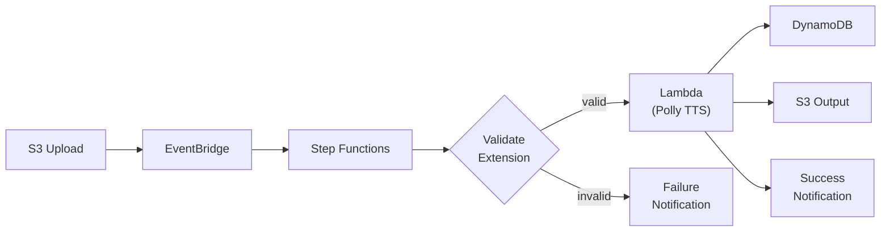

# CDK Sleep Audio Pipeline

[](https://github.com/obstreperous-ai/cdk-sleep-java-kiro/actions/workflows/ci.yml)


[](LICENSE)

A production-grade, event-driven sleep audio processing pipeline built with AWS CDK (Java). This project demonstrates **strict Test-Driven Development (TDD) for Infrastructure as Code**, driven entirely by AI-assisted agentic development from issue to pull request.

---

## Table of Contents

- [Project Overview](#project-overview)
- [Architecture Summary](#architecture-summary)
- [Quick Start](#quick-start)
- [Running Tests](#running-tests)
- [CI/CD Pipeline](#cicd-pipeline)
- [Multi-Environment Configuration](#multi-environment-configuration)
- [Experiment Methodology](#experiment-methodology)
- [Meta-Prompting Patterns](#meta-prompting-patterns)
- [Experiment Design](#experiment-design)
- [Project Structure](#project-structure)
- [Contributing](#contributing)
- [Further Reading](#further-reading)
- [License](#license)

---

## Project Overview

This project implements a serverless audio processing pipeline that:

1. Accepts raw audio file uploads to an S3 input bucket
2. Triggers an AWS Step Functions state machine via EventBridge
3. Validates file extensions using a Choice state (zero-cost rejection of invalid uploads)
4. Processes audio through a Python Lambda that calls Amazon Polly for text-to-speech synthesis
5. Stores processed audio in a versioned S3 output bucket
6. Tracks metadata in DynamoDB (audioId, status, timestamps, output location)
7. Delivers KMS-encrypted success/failure notifications via SNS

The entire infrastructure is defined as code, validated by 100+ CDK assertion tests, and deployable across multiple environments (dev/stage/prod) without modification.

### Key Characteristics

| Aspect | Detail |
|--------|--------|
| **Development Methodology** | Pure issue-driven TDD, executed by AI agents |
| **Infrastructure** | 10 AWS services, single-stack deployment |
| **Testing** | 15 test files, 100+ assertions, zero AWS credentials required |
| **Orchestration** | Step Functions with Choice-based validation and granular error handling |
| **Observability** | X-Ray tracing, CloudWatch alarms, dashboard, structured logging |
| **Security** | KMS encryption, SSL enforcement, least-privilege IAM, block public access |

---

## Architecture Summary



**Pipeline Flow:**

```
Upload -> EventBridge -> PutMetadataRecord (DynamoDB)
  -> ValidateFileExtension (Choice: .wav, .mp3, .ogg)
    -> [valid] -> ProcessAudioMetadata (Lambda) -> UpdateStatus (COMPLETED) -> SNS Success
    -> [invalid] -> ValidationError -> UpdateStatus (FAILED) -> SNS Failure
```

All critical tasks have retry policies for transient errors, and Catch blocks route failures to the error notification path with granular, service-specific error catching.

For the complete architecture with full Mermaid diagram, security details, cost analysis, and multi-environment strategy, see [ARCHITECTURE.md](ARCHITECTURE.md).

---

## Quick Start

### Prerequisites

- **Java 17** or later (project compiled at source level 17)
- **Maven 3.9+** (build and dependency management)
- **Node.js 20+** (required for AWS CDK CLI)
- **AWS CDK CLI** (`npm install -g aws-cdk`)
- **AWS account and credentials** (for deployment only; tests run without AWS access)

### Steps

1. **Clone the repository:**

   ```bash
   git clone https://github.com/obstreperous-ai/cdk-sleep-java-kiro.git
   cd cdk-sleep-java-kiro
   ```

2. **Compile the project:**

   ```bash
   mvn compile
   ```

3. **Run the test suite:**

   ```bash
   mvn test
   ```

4. **Synthesize CloudFormation templates:**

   ```bash
   NODE_OPTIONS="" npx cdk synth
   ```

5. **Deploy to your AWS account (optional):**

   ```bash
   npx cdk deploy
   ```

> **Note:** If `NODE_OPTIONS` is set in your environment (common in corporate proxies), you must clear it before running CDK commands: `NODE_OPTIONS="" npx cdk synth`

---

## Running Tests

The project includes 15 test files with 100+ CDK assertion tests that validate all infrastructure components without requiring AWS credentials or deployed resources.

```bash
# Run all tests
mvn test

# Run a specific test class
mvn test -Dtest=EndToEndFlowTest

# Run with verbose output
mvn test -X

# Package (compile + test)
mvn package
```

### Test Categories

| Category | Test Files | What They Validate |
|----------|-----------|-------------------|
| **Resource Tests** | `CdkBaseTest`, `DynamoDbMetadataTest`, `LambdaFunctionTest`, `SnsNotificationTest` | Individual resource properties (encryption, billing mode, runtime, permissions) |
| **Integration Tests** | `PipelineWiringTest`, `InputValidationTest`, `AudioProcessingTest` | Cross-resource wiring (EventBridge to Step Functions, Lambda permissions) |
| **Flow Tests** | `StepFunctionsTest`, `AdvancedErrorHandlingTest` | State machine ordering, Catch routing, retry configuration |
| **End-to-End Tests** | `EndToEndFlowTest`, `ComprehensiveEndToEndTest` | Complete pipeline integrity, resource counts, IAM permissions |
| **Environment Tests** | `MultiEnvironmentTest` | Environment tagging via CDK context |
| **Pipeline Tests** | `PipelineConstructTest` | CDK Pipelines stack synthesis |
| **Regression Tests** | `SnapshotTest` | Full template snapshot for drift detection |
| **Observability Tests** | `ObservabilityTest` | CloudWatch alarms, dashboard, X-Ray tracing |

### Testing Patterns Used

- **Template.fromStack()** - Synthesize a stack and assert against the CloudFormation template
- **hasResourceProperties()** - Verify resources exist with specific properties
- **Match.objectLike() / Match.arrayWith()** - Flexible property matching
- **ObjectMapper JSON parsing** - Parse Step Functions DefinitionString for flow validation
- **findResources()** - Count and inspect resources by type

---

## CI/CD Pipeline

The GitHub Actions workflow ([`.github/workflows/ci.yml`](.github/workflows/ci.yml)) runs on every push to `main` and on all pull requests:

1. **Setup** - Java 17 (Temurin) + Node.js 20 + AWS CDK CLI
2. **Test** - Runs all Maven tests (`mvn test`)
3. **Synth (dev)** - Synthesizes CloudFormation for the default environment
4. **Synth (prod)** - Synthesizes CloudFormation for the production environment (`-c environment=prod`)

A `PipelineStack` also provides a CDK Pipelines skeleton for automated AWS deployments via CodePipeline (currently using a placeholder CodeStar connection ARN).

---

## Multi-Environment Configuration

The project uses CDK context values to drive environment-specific configuration. The default environment is `dev`, configured in `cdk.json`.

### Deploy to a Specific Environment

```bash
# Default (dev)
npx cdk deploy

# Production
npx cdk deploy -c environment=prod

# Staging
npx cdk deploy -c environment=stage

# Compare changes before deploying
npx cdk diff
```

### Environment-Driven Behavior

The `environment` context value controls:

- **Resource tagging** - All resources receive an `Environment` tag
- **Stack naming conventions** - Environment-prefixed resource names
- **Future settings** - Log retention (7/30/90 days), alarm thresholds, feature flags

### CDK Context Defaults

Defined in `cdk.json`:
- `environment`: `"dev"` (default)
- AWS CDK feature flags for best-practice defaults (new-style stack synthesis, enforced policies)

---

## Experiment Methodology

This project serves as an experiment in **AI-agent-driven infrastructure development** using strict TDD practices.

### Development Approach

Every feature in this project was developed through the following cycle:

1. **Issue Creation** - A GitHub issue defines the feature requirements and acceptance criteria
2. **AI Agent Execution** - An AI agent picks up the issue and implements it following strict guidelines
3. **TDD Discipline** - Failing tests are written before any implementation code
4. **Verification** - `mvn test` + `npx cdk synth` must pass before any commit
5. **Pull Request** - Changes are submitted as a PR with conventional commit messages
6. **Architecture Sync** - ARCHITECTURE.md is updated to reflect any structural changes

### Core Principles

| Principle | Description |
|-----------|-------------|
| **TDD-First** | Every infrastructure construct is preceded by a failing CDK assertion test |
| **Architecture as Source of Truth** | ARCHITECTURE.md is the authoritative design document; code follows the architecture, never the reverse |
| **Conventional Commits** | All commits follow `type: description` format (`feat:`, `fix:`, `docs:`, `chore:`, `refactor:`) |
| **Defense-in-Depth** | Validation at multiple levels (Step Functions Choice + Lambda re-validation) |
| **Single Stack Simplicity** | All resources in one stack to avoid cross-stack reference complexity |

### What Worked Well

- **TDD provided confidence** - Every change was immediately validated against 100+ assertions
- **CDK assertions are powerful** - Template-level testing catches misconfiguration before deployment
- **Single stack simplicity** - Avoided cross-stack reference complexity
- **Step Functions for orchestration** - Built-in retries and catches eliminated custom error handling code
- **Separation of validation levels** - Choice state prevents unnecessary Lambda invocations for invalid files
- **Issue-driven development** - Clear scope boundaries prevented feature creep

### Challenges Encountered

- **CDK Java jsii quirks** - IAM policy statements are expanded differently than expected; tests needed adaptation
- **Step Functions JSON parsing** - Validating state machine flow requires parsing the DefinitionString JSON
- **Node.js proxy interference** - `NODE_OPTIONS` bootstrap module conflicts required clearing the variable for CDK commands
- **Template snapshot drift** - Full template snapshots are brittle and break on CDK version updates

---

## Meta-Prompting Patterns

This project was built using reusable meta-prompting patterns that guide AI agents through TDD infrastructure development. These patterns encode:

- **Persona definition** - The agent operates as a "Senior AWS CDK Java TDD Specialist"
- **Workflow constraints** - Tests before implementation, architecture sync, conventional commits
- **Verification gates** - Mandatory `mvn test` + `npx cdk synth` before any commit
- **CDK-specific guidance** - jsii quirks, ObjectMapper for Step Functions, Template.fromStack patterns

These patterns are portable and can be adapted for other CDK projects, Terraform modules, or any infrastructure-as-code workflow.

See [META-PROMPTS.md](META-PROMPTS.md) for the complete collection of reusable prompt templates.

---

## Experiment Design

This repository is one cell in a **5 languages x 3 AIs** experimental matrix evaluating AI-agent-driven infrastructure development. The experiment tests whether AI agents can produce production-quality IaC when given structured meta-prompts, strict TDD constraints, and architecture-as-source-of-truth workflows.

Key aspects of the experimental design:

- **Matrix**: 15 repositories total (Java, TypeScript, Python, Go, Terraform) x (Kiro, Claude, other AIs)
- **Actor**: Kiro + Java CDK (this repository)
- **Protocol**: Issue-driven TDD, 14 sequential issues from bootstrap to documentation
- **Controls**: Same pipeline concept across all cells; agent guidelines and verification gates standardized
- **Evaluation Criteria**: Code quality, process quality, agent effectiveness, language suitability, reproducibility

See [EXPERIMENT.md](EXPERIMENT.md) for the comprehensive experiment design document including methodology, prompting patterns, issue history, key decisions, and preliminary observations.

---

## Project Structure

```
cdk-sleep-java-kiro/
├── src/
│   ├── main/
│   │   ├── java/com/myorg/
│   │   │   ├── CdkBaseApp.java              # CDK app entry point
│   │   │   ├── CdkBaseStack.java            # Main infrastructure stack (~450 LOC)
│   │   │   └── PipelineStack.java            # CI/CD pipeline stack
│   │   └── resources/
│   │       └── lambda/audio-processor/
│   │           └── index.py                  # Python Lambda function (~200 LOC)
│   └── test/
│       └── java/com/myorg/
│           ├── AdvancedErrorHandlingTest.java # Catch blocks, retry policies
│           ├── AudioProcessingTest.java       # Lambda invoke task, processing chain
│           ├── CdkBaseTest.java              # Core stack synthesis
│           ├── ComprehensiveEndToEndTest.java # Cross-cutting E2E validation
│           ├── DynamoDbMetadataTest.java     # DynamoDB configuration
│           ├── EndToEndFlowTest.java         # Pipeline flow ordering
│           ├── InputValidationTest.java      # Choice state validation logic
│           ├── LambdaFunctionTest.java       # Lambda configuration and permissions
│           ├── MultiEnvironmentTest.java     # Environment tagging
│           ├── ObservabilityTest.java        # Alarms, dashboard, X-Ray
│           ├── PipelineConstructTest.java    # CDK Pipelines synthesis
│           ├── PipelineWiringTest.java       # EventBridge integration
│           ├── SnapshotTest.java             # Template regression detection
│           ├── SnsNotificationTest.java      # SNS topics, KMS encryption
│           ├── StepFunctionsTest.java        # State machine definition
│           └── TestUtils.java                # Shared test utilities
├── .github/
│   ├── workflows/ci.yml                      # CI: tests + cdk synth (dev + prod)
│   └── AGENT_GUIDELINES.md                   # Guidelines for AI agent contributors
├── ARCHITECTURE.md                            # Detailed architecture (435 lines, Mermaid diagram)
├── CONTRIBUTING.md                            # Contribution guidelines and TDD workflow
├── META-PROMPTS.md                            # Reusable meta-prompting patterns
├── SUMMARY.md                                 # Project summary and experiment notes
├── LICENSE                                    # Apache License 2.0
├── cdk.json                                   # CDK configuration and context
├── pom.xml                                    # Maven build (CDK 2.255.0+, JUnit 5.7.1)
└── mise.toml                                  # Tool version management
```

---

## Contributing

See [CONTRIBUTING.md](CONTRIBUTING.md) for:

- Commit message conventions (conventional commits)
- TDD-first workflow (write failing test, implement, verify)
- Development setup and prerequisites
- Architecture sync requirements
- Testing patterns and examples

AI agent contributors should also review [.github/AGENT_GUIDELINES.md](.github/AGENT_GUIDELINES.md).

---

## Further Reading

| Document | Description |
|----------|-------------|
| [ARCHITECTURE.md](ARCHITECTURE.md) | Full architecture, data flow, Mermaid diagram, security, cost analysis |
| [CONTRIBUTING.md](CONTRIBUTING.md) | TDD workflow, commit conventions, development setup |
| [META-PROMPTS.md](META-PROMPTS.md) | Reusable meta-prompting patterns for AI-driven IaC development |
| [EXPERIMENT.md](EXPERIMENT.md) | Experiment design, methodology, actors, observations, and evaluation criteria |
| [SUMMARY.md](SUMMARY.md) | Key decisions, metrics, experiment notes, challenges |
| [.github/AGENT_GUIDELINES.md](.github/AGENT_GUIDELINES.md) | Operational guidelines for AI agent contributors |

---

## License

This project is licensed under the Apache License 2.0. See [LICENSE](LICENSE) for details.
